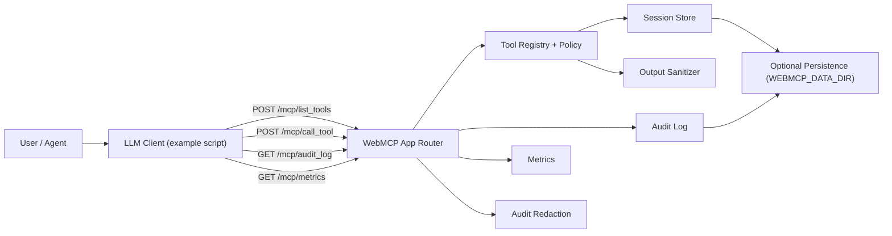

# Architecture

This diagram reflects the current playground runtime.

## Components

- `src/app.ts`: HTTP routing, request validation, protocol-version checks.
- `src/tools.ts`: tool catalog, policy evaluation, schema validation, execution.
- `src/policy.ts`: confirmation and session requirements.
- `src/session-store.ts`: session-scoped state for tools.
- `src/audit-log.ts`: audit entries and query path.
- `src/metrics.ts`: runtime counters, error codes, and latency summaries.
- `src/redaction.ts`: audit argument/result redaction.
- `src/output-sanitizer.ts`: risky output filtering.
- `src/store-config.ts` + `src/persistence.ts`: optional file-backed state.
